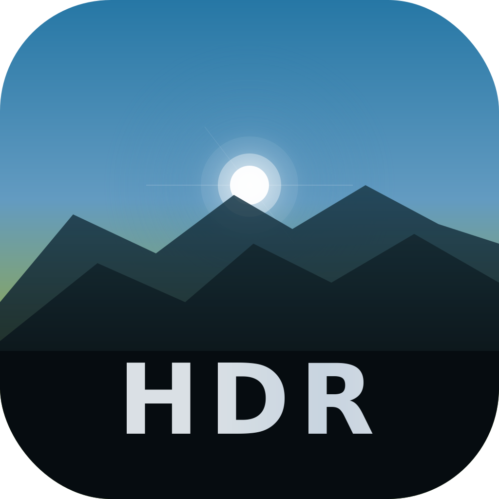

# Spectrum

A native macOS photo and video viewer built for **HDR content** — designed to correctly render Sony HLG, Apple Gain Map, and other HDR formats that macOS Preview/Photos cannot properly display.



## Why Spectrum?

Apple's built-in apps do not correctly tone-map Sony's HLG HDR images, resulting in washed-out or incorrectly exposed photos. Spectrum implements a dedicated HDR rendering pipeline with full Extended Dynamic Range (EDR) support, so your HDR photos and videos look the way they should on an HDR display.

## Features

### HDR Photo Rendering

- **HLG (Hybrid Log-Gamma)** — Sony's HDR still image format, rendered via native `itur_2100_HLG` color space with proper BT.2020 gamut and EDR headroom
- **Apple Gain Map HDR** — iPhone HDR photos with auxiliary gain map data
- **HDR/SDR Toggle** — Click the HDR badge to instantly compare HDR vs SDR rendering

### HDR Video Playback

- **Dual player backends** — libmpv (OpenGL render API) and AVPlayer, selectable per HDR type
- **HDR formats** — HLG, HDR10, Dolby Vision, S-Log2, S-Log3, SDR
- **HDR/SDR composition switching** — Toggle HDR on/off during playback
- **Hardware decoding** — VideoToolbox acceleration with configurable decode modes (auto, videotoolbox, videotoolbox-copy, software)
- **Per-type player override** — Choose libmpv or AVPlayer independently for each HDR format (e.g. AVPlayer for Dolby Vision, mpv for HLG)
- **Playback diagnostics** — On-screen badge showing render FPS, stability metric, codec info, and dropped frame counts

### Gyroscope Stabilization (Gyroflow)

Real-time video stabilization powered by [gyroflow-core](https://github.com/gyroflow/gyroflow), using embedded IMU (gyroscope/accelerometer) sensor data from the camera.

- **In-process stabilization** — Per-frame 3D perspective correction via `libgyrocore_c.dylib` (no subprocess)
- **Sony IBIS support** — Per-scanline in-body image stabilization data (tested with Sony ZV-E1)
- **Configurable parameters** — Smoothing (global or per-axis pitch/yaw/roll), gyro sync offset, lens profile (.gyroflow), FOV scaling, horizon lock, adaptive zoom
- **Per-video override** — Each video can have custom gyro config, independent of global settings
- **Toggle on/off** — Press `s` during mpv playback to enable/disable stabilization in real time

### Browsing & Navigation

- **Folder-based browsing** — Scan existing folders directly, no import or copy
- **Timeline grid** — Photos grouped by date (Today, This Week, This Month, Older) with adaptive column layout
- **Keyboard navigation** — Arrow keys to move, Enter to open, Escape to go back
- **Subfolder tiles** — Subfolders displayed as cover-image tiles, sorted by most recent photo
- **Sidebar** — Folder tree with breadcrumb navigation, context menu (rename, copy, cut, paste, show in Finder)
- **Drag & drop** — Add folders by dragging from Finder

### Metadata & Inspector

- **EXIF inspector** — Toggle with `i` key: file info, camera/lens, exposure settings (aperture, shutter, ISO, focal length, exposure bias, metering, flash, white balance), GPS coordinates
- **HDR metadata** — Color profile, bit depth, headroom value, dynamic range indicator
- **Video metadata** — Duration, video codec, audio codec

### Other

- **Fullscreen mode** — `f` key or Cmd+F for distraction-free viewing
- **Thumbnail caching** — Three-tier cache (memory + disk + on-demand), configurable size limit (100 MB – 2 GB), LRU eviction
- **Security-scoped bookmarks** — macOS Sandbox compatible with persistent folder access
- **File format support** — JPEG, HEIF/HEIC, PNG, TIFF, RAW (DNG, CR3, NEF, etc.), MP4, MOV, MKV

## Requirements

- macOS 14.0 (Sonoma) or later
- Xcode 16+ (for building from source)
- [Rust toolchain](https://rustup.rs/) (for gyroflow-core; optional if you don't need gyro stabilization)
- HDR display recommended (e.g. Apple Pro Display XDR, MacBook Pro with Liquid Retina XDR)

## Build

### Prerequisites

```bash
# Build tools and library headers (required for compiling libmpv from source)
brew install meson ninja nasm pkg-config libass libplacebo little-cms2

# Rust toolchain (required for gyroflow-core)
curl --proto '=https' --tlsv1.2 -sSf https://sh.rustup.rs | sh
```

### Build & Package

```bash
# Clone with submodules (mpv, FFmpeg, gyroflow)
git clone --recurse-submodules https://github.com/chenpc/Spectrum.git
cd Spectrum

# Build Release (automatically compiles mpv + FFmpeg on first run)
./release.sh
```

The DMG will be created in the project root directory.

To rebuild mpv or gyroflow-core manually:

```bash
./mpv-build/build-all.sh        # build FFmpeg + mpv + bundle dylibs
./mpv-build/build-all.sh clean   # remove all build artifacts

cd gyro-wrapper && cargo build --release   # rebuild gyroflow-core
```

### Without building from source

If you skip the Homebrew prerequisites, the Xcode build will:
- **libmpv** — fall back to IINA.app's bundled libmpv (if IINA is installed)
- **gyroflow-core** — gyro stabilization will be unavailable

The app works without either library — video playback falls back to AVPlayer.

## Architecture

```
Spectrum/
├── Models/           # SwiftData models (Photo, ScannedFolder)
├── Views/
│   ├── Sidebar/      # Folder tree navigation
│   ├── Grid/         # Timeline photo grid with keyboard nav
│   └── Detail/       # HDR photo/video detail view, mpv + AVPlayer
├── Services/
│   ├── ImagePreloadCache.swift  # HDR format detection + rendering
│   ├── MPVLib.swift             # libmpv runtime loader (dlopen)
│   ├── GyroCore.swift           # gyroflow-core runtime loader
│   ├── FolderScanner.swift      # Filesystem scanning (@ModelActor)
│   └── ThumbnailService.swift   # Three-tier thumbnail cache
├── ViewModels/       # Timeline section logic
└── Resources/        # App icon, bundled dylibs

mpv-build/            # Shell scripts to build libmpv from source
mpv/                  # Git submodule — mpv player
FFmpeg/               # Git submodule — FFmpeg
gyro-wrapper/         # Rust cdylib wrapper for gyroflow-core
gyroflow/             # Git submodule — gyroflow
```

## License

MIT
