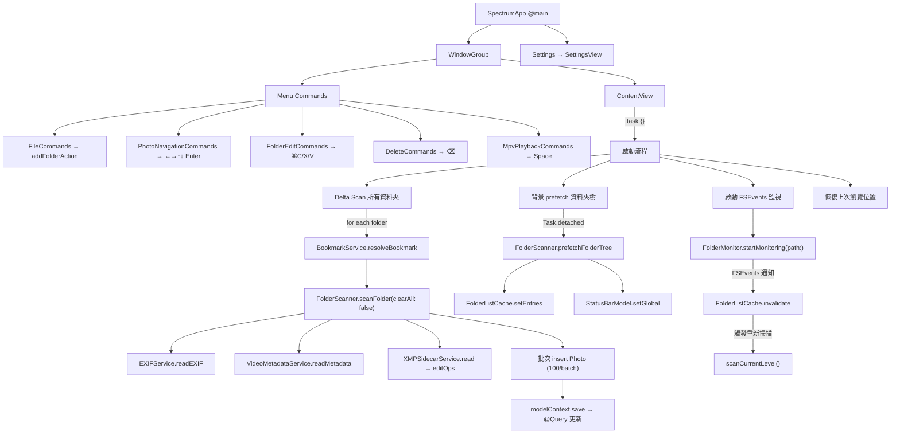
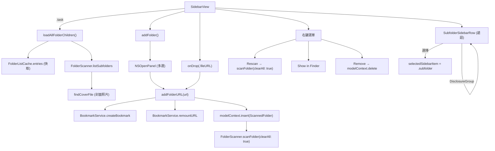
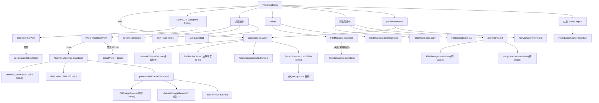
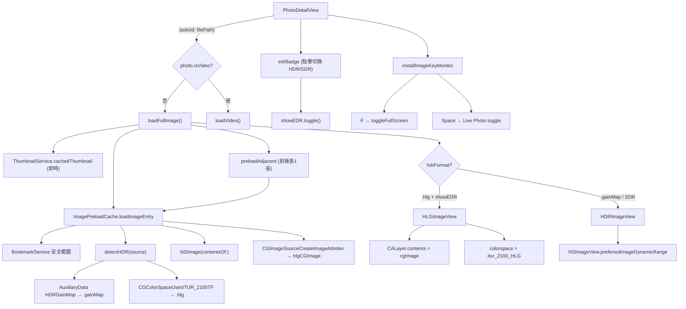
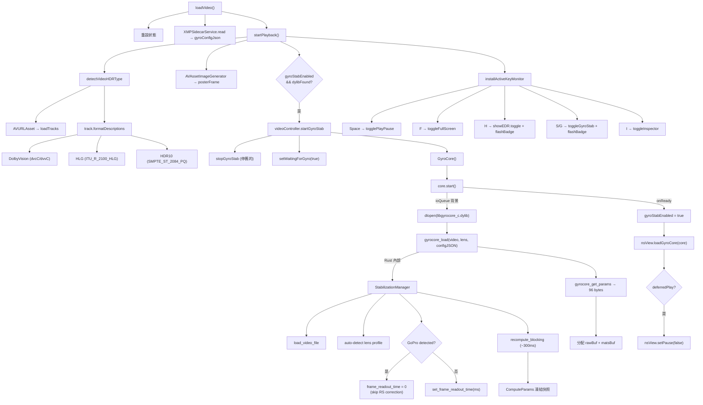
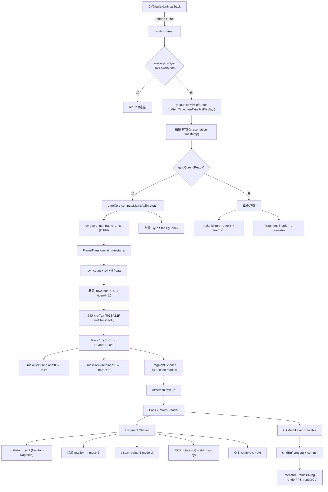
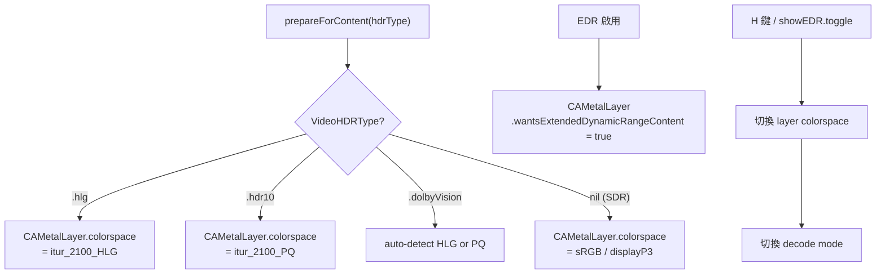
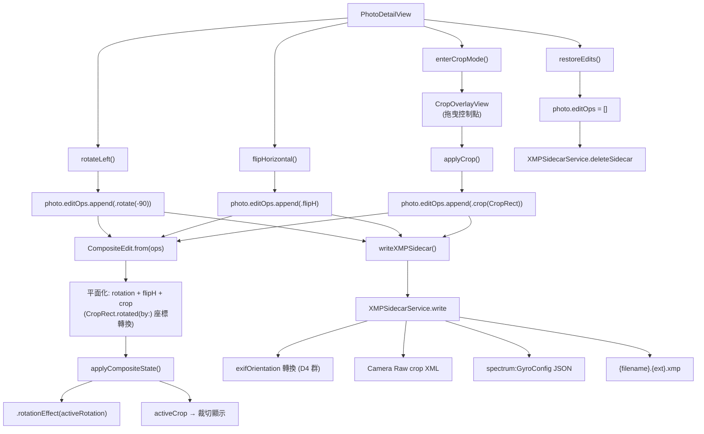
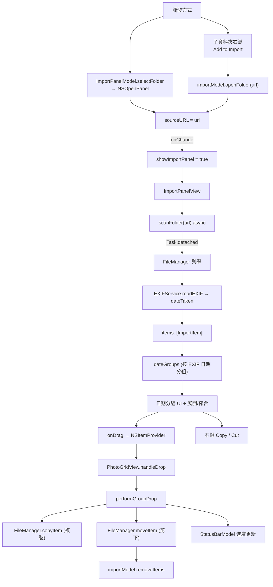

# Spectrum Call Graph

## 1. App 啟動與資料夾掃描

## 2. 側邊欄與資料夾管理

## 3. 照片網格

## 4. 照片詳情與 HDR

## 5. 影片播放 + Gyro

## 6. Metal 渲染管線 (renderFrame)

## 7. HDR Colorspace 管理

## 8. 非破壞性編輯

## 9. 匯入面板

